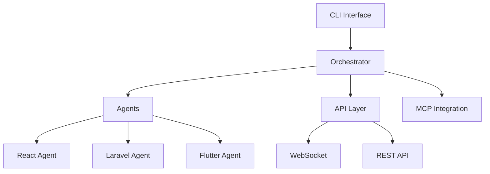
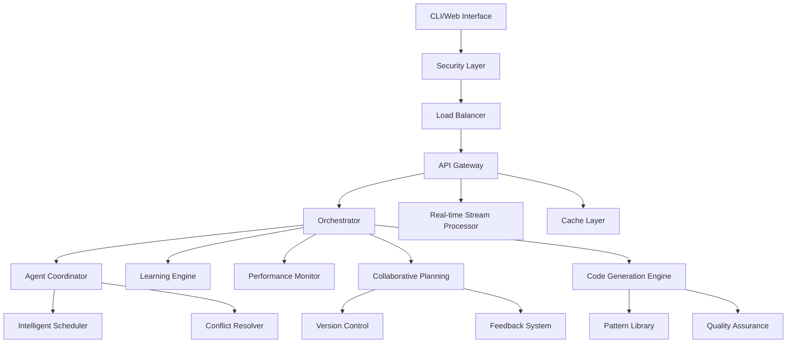

# Sanaa AI Coding Agents System Enhancement Analysis

## Executive Summary

The current Sanaa system demonstrates a solid foundation with modular architecture, multi-framework support, and advanced agent capabilities. This analysis provides comprehensive recommendations to transform it into a robust, scalable, and user-friendly all-in-one coding assistance platform.

## Current System Architecture Analysis

### Strengths
- **Modular Design**: Well-organized package structure (agents, core, orchestrator, API, CLI, plugins)
- **Multi-Framework Support**: Specialized agents for React, Laravel, Flutter, and Next.js
- **Advanced Capabilities**: Framework-specific debugging, comprehensive planning, and MCP integration
- **Extensibility**: Plugin system and MCP server integration for third-party tools

### Current Limitations
- **Security Gaps**: Limited encryption, access controls, and vulnerability assessment
- **Scalability Issues**: Basic API design without advanced real-time handling
- **Agent Coordination**: Simple task delegation without conflict resolution
- **Learning Capabilities**: No self-learning algorithms or continuous improvement
- **User Experience**: Limited collaborative interfaces and monitoring tools

## Detailed Enhancement Recommendations

### 1. Security Framework Enhancement

#### Current State
- Basic authentication in API layer
- No encryption for data at rest/transit
- Limited access control mechanisms

#### Recommendations
```python
# Enhanced Security Module Structure
class SecurityManager:
    def __init__(self):
        self.encryption = EncryptionHandler()
        self.access_control = AccessControlEngine()
        self.vulnerability_scanner = VulnerabilityScanner()

    async def encrypt_sensitive_data(self, data: dict) -> dict:
        """Encrypt sensitive project data and API keys"""

    async def validate_access(self, user: str, resource: str, action: str) -> bool:
        """RBAC-based access control with fine-grained permissions"""

    async def scan_vulnerabilities(self, codebase: str) -> List[Vulnerability]:
        """Automated security vulnerability assessment"""
```

#### Implementation Steps
1. Implement end-to-end encryption for all data
2. Add OAuth2/JWT authentication with refresh tokens
3. Create role-based access control (RBAC) system
4. Integrate automated vulnerability scanning
5. Add security headers and CSP policies

### 2. API Integration Improvements

#### Current State
- Basic FastAPI implementation with WebSocket support
- Simple task execution and logging
- Limited scalability features

#### Enhanced Architecture
```python
# Scalable API Architecture
class EnhancedAPI:
    def __init__(self):
        self.load_balancer = LoadBalancer()
        self.cache_manager = RedisCache()
        self.stream_processor = RealTimeStreamProcessor()
        self.rate_limiter = RateLimiter()

    async def handle_request(self, request: Request) -> Response:
        """Load-balanced, cached, rate-limited request handling"""

    async def stream_realtime_updates(self, client_id: str):
        """Real-time streaming with WebSocket connection pooling"""
```

#### Key Improvements
1. **Scalability**: Implement horizontal scaling with load balancers
2. **Real-time Processing**: Enhanced WebSocket handling with connection pooling
3. **Caching Layer**: Redis-based caching for API responses
4. **Rate Limiting**: Intelligent rate limiting with burst handling
5. **API Versioning**: Semantic versioning with backward compatibility

### 3. Agent Workflow Optimization

#### Current State
- Basic task delegation through orchestrator
- Simple dependency resolution
- No conflict detection or resolution

#### Advanced Coordination System
```python
# Enhanced Agent Coordination
class AdvancedOrchestrator:
    def __init__(self):
        self.conflict_resolver = ConflictResolutionEngine()
        self.learning_engine = SelfLearningAlgorithm()
        self.task_scheduler = IntelligentScheduler()

    async def coordinate_agents(self, goal: str) -> ExecutionPlan:
        """Intelligent agent coordination with conflict resolution"""

    async def resolve_conflicts(self, conflicts: List[Conflict]) -> Resolution:
        """Automated conflict resolution using learned patterns"""

    async def learn_from_execution(self, execution_data: dict):
        """Self-learning from successful/failed executions"""
```

#### Implementation Features
1. **Intelligent Task Delegation**: ML-based agent selection
2. **Conflict Resolution**: Automated resolution algorithms
3. **Self-Learning**: Pattern recognition and optimization
4. **Dynamic Scheduling**: Real-time task prioritization
5. **Resource Optimization**: Agent workload balancing

### 4. Advanced Features Implementation

#### Collaborative Planning Interface
```python
# Collaborative Planning System
class CollaborativePlanner:
    def __init__(self):
        self.real_time_collaboration = RealTimeCollaboration()
        self.version_control = PlanningVersionControl()
        self.feedback_system = FeedbackCollection()

    async def create_shared_plan(self, stakeholders: List[str]) -> SharedPlan:
        """Real-time collaborative planning with version control"""

    async def collect_feedback(self, plan: Plan) -> FeedbackReport:
        """Automated feedback collection and analysis"""
```

#### Enhanced Code Generation
```python
# Advanced Code Generation
class CodeGenerationEngine:
    def __init__(self):
        self.pattern_library = PatternLibrary()
        self.quality_assurance = CodeQualityChecker()
        self.performance_optimizer = PerformanceOptimizer()

    async def generate_optimized_code(self, requirements: dict) -> GeneratedCode:
        """AI-powered code generation with quality assurance"""

    async def optimize_performance(self, code: str) -> OptimizedCode:
        """Automated performance optimization"""
```

#### Comprehensive Performance Monitoring
```python
# Performance Monitoring System
class PerformanceMonitor:
    def __init__(self):
        self.metrics_collector = MetricsCollector()
        self.alert_system = AlertSystem()
        self.predictive_analyzer = PredictiveAnalyzer()

    async def monitor_system_health(self) -> HealthReport:
        """Real-time system performance monitoring"""

    async def predict_issues(self, metrics: dict) -> Predictions:
        """Predictive analytics for potential issues"""
```

### 5. Continuous Improvement Framework

#### Self-Learning Algorithms
```python
# Self-Learning Framework
class SelfLearningEngine:
    def __init__(self):
        self.pattern_recognizer = PatternRecognizer()
        self.feedback_processor = FeedbackProcessor()
        self.model_updater = ModelUpdater()

    async def learn_from_feedback(self, feedback: dict):
        """Continuous learning from user feedback and execution results"""

    async def optimize_workflows(self, performance_data: dict):
        """Automated workflow optimization based on performance metrics"""
```

#### Deployment Automation
```python
# Deployment Automation
class DeploymentAutomator:
    def __init__(self):
        self.ci_cd_pipeline = CICDPipeline()
        self.environment_manager = EnvironmentManager()
        self.rollback_system = RollbackSystem()

    async def automated_deployment(self, changes: dict) -> DeploymentResult:
        """Zero-downtime deployment with automated testing"""

    async def rollback_on_failure(self, deployment_id: str):
        """Intelligent rollback with minimal downtime"""
```

## Implementation Roadmap

### Phase 1: Foundation (Weeks 1-4)
- [ ] Security framework implementation
- [ ] Basic API enhancements
- [ ] Core monitoring setup

### Phase 2: Core Features (Weeks 5-8)
- [ ] Advanced agent coordination
- [ ] Collaborative planning interface
- [ ] Enhanced code generation

### Phase 3: Intelligence (Weeks 9-12)
- [ ] Self-learning algorithms
- [ ] Predictive analytics
- [ ] Performance optimization

### Phase 4: Production (Weeks 13-16)
- [ ] Deployment automation
- [ ] User interface polish
- [ ] Comprehensive testing

## Success Metrics

### Technical Metrics
- **Security**: Zero critical vulnerabilities in production
- **Performance**: <500ms API response time, 99.9% uptime
- **Scalability**: Support for 1000+ concurrent users
- **Code Quality**: >90% test coverage, <10% technical debt

### User Experience Metrics
- **Satisfaction**: >4.5/5 user satisfaction rating
- **Adoption**: >80% feature adoption rate
- **Efficiency**: 50% reduction in development time
- **Reliability**: <0.1% error rate in production

## Architectural Diagrams

### Current Architecture


### Enhanced Architecture


## Conclusion

This enhancement plan transforms Sanaa into a comprehensive, enterprise-grade coding assistance platform. The modular approach ensures maintainability while the advanced features provide significant value to developers. Implementation should follow the phased approach to minimize risks and ensure quality.

**Next Steps:**
1. Review and approve this enhancement plan
2. Prioritize features based on user needs
3. Begin implementation with Phase 1 foundation work
4. Establish monitoring and feedback loops for continuous improvement